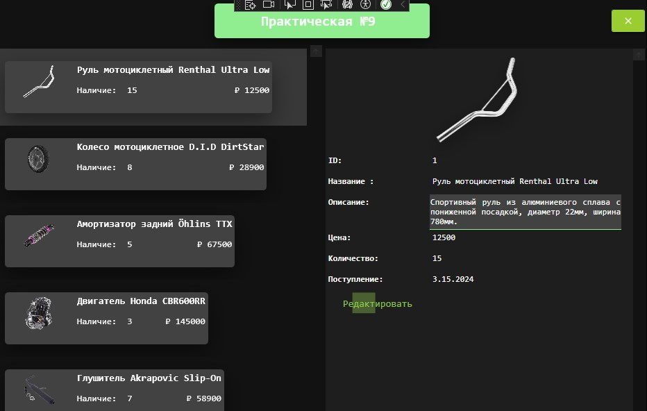
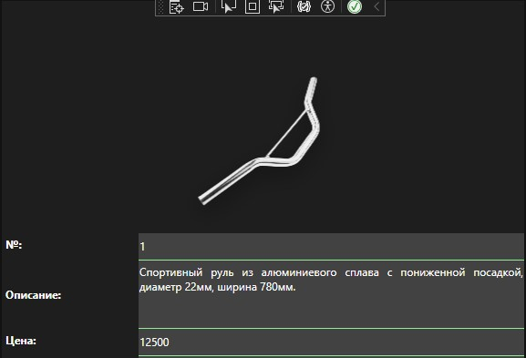

<h1>Практическая работа №9. Паттерн MVVM</h1>

<h3>Описание проекта</h3>

WPF-приложение для управления товарами с использованием:

<ul>
  <li><strong>Паттерна MVVM</strong> - архитектурный подход</li>
</ul>

<h3>Основной функционал</h3>
<ul>
  <li>Просмотр каталога товаров</li>
  <li>Редактирование информации о товарах</li>
  <li>Удаление товаров из каталога</li>
</ul>

<h3>Инструкция по запуску</h3>
<ol>
  <li>Запустить исполняемый файл приложения</li>
</ol>

<h3>Интерфейс приложения</h3>
<table border="0" cellspacing="10">
 <tr>
  <td>
   
  </td>
  <td>
   
  </td>
 </tr>
 <tr>
  <td>
   
  </td>
  <td>
   
  </td>
 </tr>
</table>
