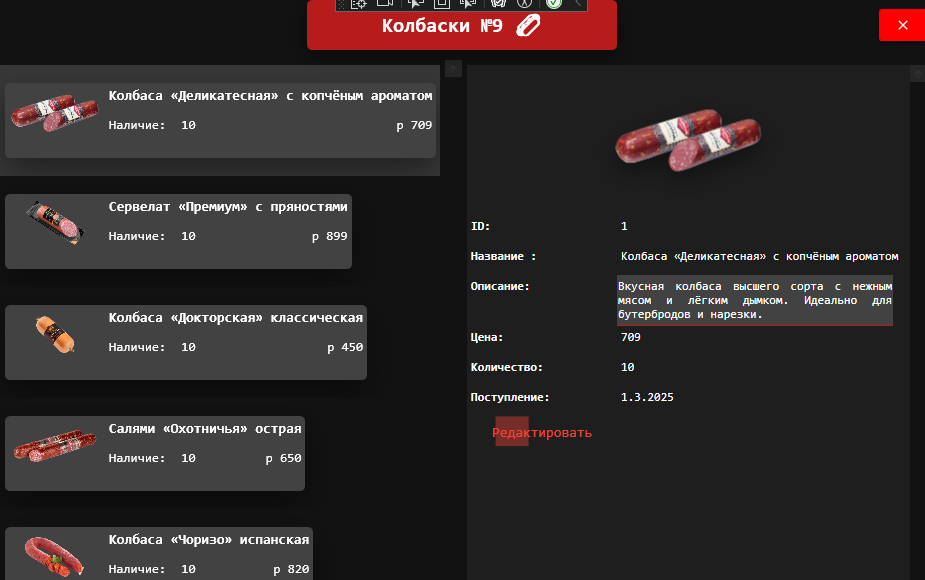
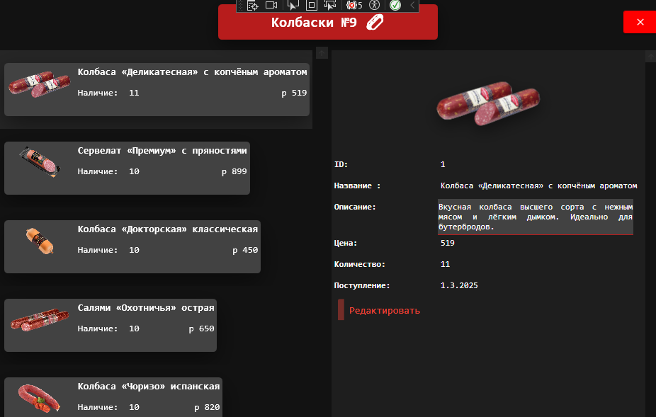

<h1>Практическая №"9 патерн MVVE</h1>

Проект представляет собой WPF-приложение для управления каталогом товаров, реализованное с использованием паттерна MVVM. 

Приложение позволяет просматривать, редактировать и удалять товары/

<table>
 <tr>
  <td>
   
  </td>
  <td>
   
  </td>
 </tr>
 <tr>
  <td>
   
  </td>
  <td>
   
  </td>
 </tr>
</table>
